The **Analytics** page (`http://localhost:8000/analytics`) turns everything the
WAF has recorded into charts, KPI cards and plain-language insights. Every
number is calculated live from the project database `logs/detections.db` —
nothing on the page is sample or made-up data.

This guide covers:

1. [Run the project](#run-the-project) (end to end, from a fresh clone)
2. [Open the Analytics page](#open-the-analytics-page)
3. [Add your own data](#add-your-own-data) so the charts change
4. [Reading the page](#reading-the-page), section by section
5. [Filters, date ranges and comparisons](#filters-date-ranges-and-comparisons)
6. [Exporting data](#exporting-data) and the [analytics API](#analytics-api)
7. [Troubleshooting](#troubleshooting)

# Run the project

## What you need

* **Python 3.11 or newer** (`python3 --version`)
* **Internet access** the first time (to install packages; PyTorch is about 200 MB)
* A modern browser (Chrome, Edge, Firefox or Safari)

## Option A — one command (recommended)

From the repository root:

```bash
git clone https://github.com/kuldeep31016/Web-Application-Firewall.git
cd Web-Application-Firewall/transformer-waf

./scripts/setup_and_run.sh          # macOS / Linux
scripts\setup_and_run.bat           # Windows
```

The script does everything in order:

1. creates a virtual environment in `venv/`
2. installs `requirements.txt`
3. trains or downloads any model that is missing (first run only — the WAF
   model takes about 3 minutes, the URL classifiers about 20 minutes on a CPU)
4. starts the web service on **http://localhost:8000**

Leave the terminal open — the service runs until you press **Ctrl+C**.

## Option B — step by step

```bash
cd Web-Application-Firewall/transformer-waf

# 1. virtual environment + packages
python3 -m venv venv
source venv/bin/activate            # Windows: venv\Scripts\activate
pip install -r requirements.txt

# 2. (optional) train the WAF model so new requests are scored and stored
PYTHONPATH=. python scripts/prepare_waf_data.py
PYTHONPATH=. python scripts/train_quick.py --epochs 40 --batch 64 --vocab 5000 \
    --embed 128 --heads 4 --layers 3 --ff 256 --maxlen 128 --lr 5e-4
PYTHONPATH=. python scripts/calibrate_threshold.py --benign-percentile 0.99 --write

# 3. start the service
PYTHONPATH=. python -m uvicorn src.api.detection_api:app --host 0.0.0.0 --port 8000
```

On Windows, set the path with `set PYTHONPATH=.` before the `python` commands.

> **Just want to look at the analytics?** Step 2 is optional. The repository
> already ships with a `logs/detections.db` containing 192 scored requests and
> 22 URL analyses, so the Analytics page shows real data as soon as the service
> is running. Training is only needed to **add new** requests.

The service is ready when the terminal prints
`Uvicorn running on http://0.0.0.0:8000`.

# Open the Analytics page

1. Open **http://localhost:8000/analytics** in your browser
   (or click **Analytics** in the top navigation of any page).
2. The **API key** box in the top bar is pre-filled with `dev-key`, which is the
   default key. If the service was started with a different key
   (`WAF_API_KEY=...`), type that key in the box and press Enter.
3. The page loads with **Last 30 days** selected. Because the shipped data was
   recorded on specific dates, choose **All time** in *Date range* to see
   everything.

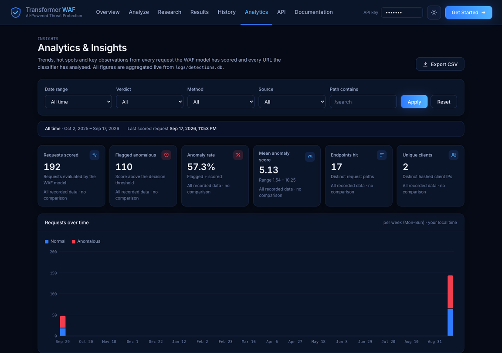

# Add your own data

The analytics update every time the WAF scores something. After any of the
actions below, change a filter or reload the Analytics page to see the new
numbers. (These actions need the trained WAF model — see Option A or step 2 of
Option B.)

| Where | What to do | What appears in Analytics |
|---|---|---|
| **Analyze** page (`/analyze`) | Score an HTTP request or analyse a URL | A new request (source *Direct*) or a new URL analysis |
| **History** page (`/history`) | Click **Replay** on any stored request | A new request with source *Replay* |
| Command line | See the `curl` commands below | New requests (source *Direct* or *Batch*) |

Score one request (a path-traversal attack):

```bash
curl -s -X POST http://localhost:8000/detect \
  -H 'X-API-Key: dev-key' -H 'Content-Type: application/json' \
  -d '{"method":"GET","path":"/download","query_params":{"file":"../../../../etc/passwd"},"headers":{},"body":""}'
```

Score a normal request and an attack together (stored as source *Batch*):

```bash
curl -s -X POST http://localhost:8000/detect/batch \
  -H 'X-API-Key: dev-key' -H 'Content-Type: application/json' \
  -d '[{"method":"GET","path":"/products","query_params":{"page":"1"},"headers":{},"body":""},
       {"method":"GET","path":"/search","query_params":{"q":"<script>alert(1)</script>"},"headers":{},"body":""}]'
```

Or run the ready-made attack suite (14 benign and malicious requests):

```bash
./scripts/run_tests.sh
```

Then open Analytics, pick **Today**, and the new requests appear in every chart.

# Reading the page

## Filter bar and range summary

The filter bar sits at the top; every chart, card and table below it follows
these filters. The grey bar underneath states exactly which dates you are
looking at, which period they are compared with, and when the last request
was scored.

## KPI cards

Six cards summarise the selected period:

| Card | Meaning |
|---|---|
| **Requests scored** | How many HTTP requests the WAF model evaluated |
| **Flagged anomalous** | How many of them scored above the decision threshold |
| **Anomaly rate** | Flagged ÷ scored, as a percentage |
| **Mean score** | Average anomaly score, with the lowest–highest score underneath |
| **Endpoints hit** | Number of different request paths (e.g. `/search`, `/login`) |
| **Unique clients** | Number of different client IP addresses (stored only as a hash) |

The last line of each card compares with the **previous period of the same
length** (e.g. *Last 7 days* is compared with the 7 days before it):

* **↑ / ↓ with a percentage** — the change versus the previous period.
  The anomaly rate change is shown in **percentage points (pp)**.
* **Red** means a rise in something bad (more anomalies, a higher rate or
  score); **green** means it fell. Volume cards (requests, endpoints, clients)
  stay grey because more traffic is neither good nor bad by itself.
* **“New · none in previous period”** — the previous period had zero, so a
  percentage change is not meaningful.
* **“All recorded data · no comparison”** — shown when *All time* is selected.

## Requests over time

A stacked bar chart: **blue = normal** requests, **red = anomalous** requests.
Each bar is one hour, one day or one week — the page picks the size from the
range length (up to 2 days → hourly, up to 120 days → daily, longer → weekly,
Monday to Sunday). Bars use **your local time**. Days with no traffic are shown
as empty slots, so gaps are real gaps.

**Hover over (or tap) any bar** to see the exact figures for that period:

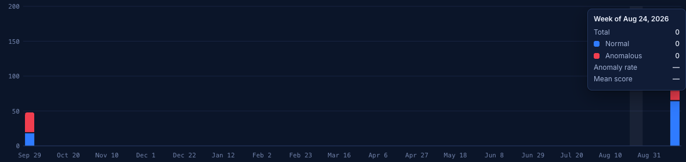

## Verdict split and score distribution

* **Verdict split** (donut): the share of requests that were normal vs
  anomalous, with counts and percentages beside it.
* **Anomaly score distribution** (histogram): how many requests fell into each
  score band. Normal requests should cluster on the left (low scores) and
  anomalies on the right. Where blue and red overlap, the model is less certain.

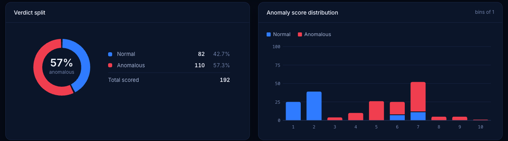

## Most-targeted endpoints and traffic mix

* **Most-targeted endpoints** lists the paths that received the most anomalous
  requests. Each row shows *anomalous / total · anomaly rate*, and the bar is
  split red (anomalous) and blue (normal).
* **Traffic mix** shows the same split by **HTTP method** (GET, POST, …) and by
  **source**: *Direct* (`/detect`), *Batch* (`/detect/batch`) or *Replay*
  (replayed from the History page).

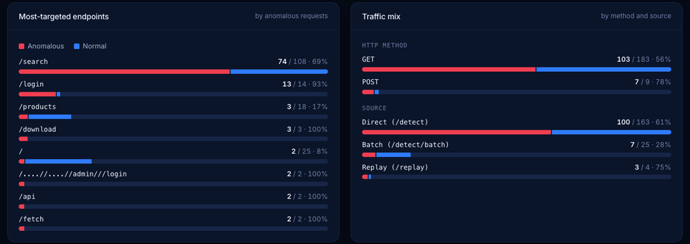

## Key insights

Short sentences that summarise what matters in the selected data. They are
produced by fixed rules from the numbers on the page (no AI guessing), and a
rule only appears when the data supports it:

| Label | Examples of when it appears |
|---|---|
| **Attention** (amber) | One endpoint receives ≥ 40 % of all anomalies; an endpoint has ≥ 50 % of its requests flagged; one client sends ≥ 50 % of flagged traffic; the anomaly rate rose by ≥ 5 pp; several thresholds were in use |
| **Improving** (green) | The anomaly rate fell by ≥ 5 pp |
| **Observation** (blue) | Traffic changed by ≥ 10 %; the busiest hour/day/week for anomalies; how many decisions were close to the threshold; median score of flagged vs normal requests; endpoints attacked that were not attacked before; small-sample warning (< 20 requests) |

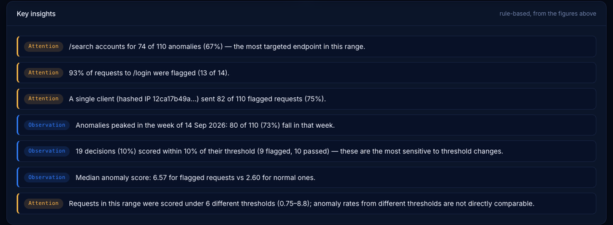

## Score statistics and decision thresholds

* **Score statistics** gives minimum, median, mean, 95th percentile (P95) and
  maximum score for all requests, anomalous ones and normal ones.
  **Margin** is how far scores sit above (+) or below (−) their threshold on
  average. The note below counts decisions **within ±10 % of the threshold** —
  those would change verdict first if the threshold were adjusted.
* **Decision thresholds** lists each threshold that was active, how many
  requests it scored and when it was used. If more than one appears, anomaly
  rates from different periods are not strictly comparable.

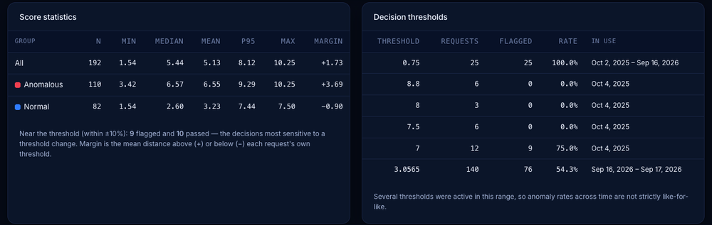

## Detailed breakdown table

A full table you can slice four ways using the tabs on the right:
**Endpoint**, **Client**, **Method** or **Source**.

* **Sort** — click any column header; click again to reverse the order.
* **Search** — type in the box to filter rows (e.g. `api`).
* **Pages** — 10 rows per page; use **Previous / Next**.
* **Δ anomalous** — change in anomalous requests versus the previous period
  (hidden for *All time*).
* **Client** rows show the start of the hashed IP; *not recorded* means the
  request had no client address (e.g. replays).

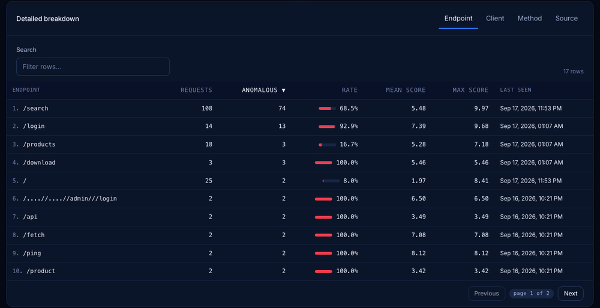

## URL classifier activity

Activity of the phishing URL classifier (every URL analysed on the Analyze page,
or sent to `/detect/url` without `"persist": false`): how many URLs were analysed, how many were classified as
phishing, average probability, inference time, how often parts of the URL were
marked unavailable, and how often the WAF model also flagged the URL. The table
breaks this down by handling strategy and model.

Only the **date range** applies here — method, verdict, path and source filters
describe HTTP requests and do not apply to URLs.

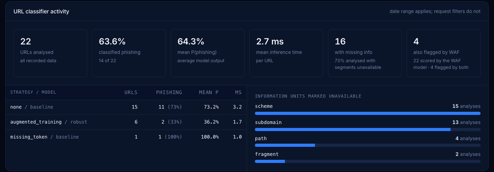

# Filters, date ranges and comparisons

| Filter | Options |
|---|---|
| **Date range** | Today · Last 7 days · Last 30 days · Last 3 months · Last 6 months · This year · All time · Custom range |
| **Verdict** | All · Anomalous · Normal |
| **Method** | All · each HTTP method found in the data |
| **Source** | All · Direct · Batch · Replay |
| **Path contains** | Any text, e.g. `login` (press **Apply** or Enter) |

* Drop-down filters apply immediately; **Reset** returns to *Last 30 days* with
  no filters.
* **Custom range** shows *From* and *To* date pickers. Both days are included
  in full (midnight to midnight, local time).
* The **previous period** is always the same length immediately before the
  selected one. *All time* has no previous period.
* The page remembers your last date-range choice in this browser.

# Exporting data

Click **Export CSV** (top right). The file contains the **Detailed breakdown**
exactly as currently filtered, grouped (Endpoint / Client / Method / Source),
searched and sorted — every row, not just the visible page. It includes
requests, anomalies, anomaly rate, mean and max score, last seen (UTC) and,
when a previous period exists, the previous-period figures.

# Analytics API

The page is powered by three endpoints that you can also call directly.
All require the `X-API-Key` header, like every other endpoint.

| Endpoint | Returns |
|---|---|
| `GET /analytics/overview` | KPIs, comparison, time series, distributions, score statistics, top endpoints, URL activity and insights |
| `GET /analytics/breakdown` | One page of the breakdown table (`group_by`, `sort`, `order`, `search`, `limit`, `offset`) |
| `GET /analytics/export` | The whole breakdown as a CSV file |

Common parameters: `start` and `end` (Unix seconds; omit both for all time),
`tz_offset` (your UTC offset in minutes, e.g. `330` for India), `verdict`
(`anomaly`/`normal`), `method`, `source` (`direct`/`batch`/`replay`), `path`.

```bash
# all-time overview
curl -s -H 'X-API-Key: dev-key' http://localhost:8000/analytics/overview

# top 5 endpoints by anomalies
curl -s -H 'X-API-Key: dev-key' \
  'http://localhost:8000/analytics/breakdown?group_by=path&sort=anomalies&limit=5'

# breakdown by client as CSV
curl -s -H 'X-API-Key: dev-key' -o clients.csv \
  'http://localhost:8000/analytics/export?group_by=client'
```

Interactive documentation for all endpoints is at
**http://localhost:8000/docs** (click *Authorize* and enter `dev-key`).

# Troubleshooting

| Problem | Fix |
|---|---|
| Browser says *can't connect* | The service is not running. Start it (Option A or B) and keep the terminal open. |
| **“Unable to load analytics — The API rejected the key”** | Type the correct key (default `dev-key`) in the *API key* box in the top bar, press Enter, then **Retry**. |
| **“No analytics data available”** | Nothing matches the date range and filters. Choose **All time** or press **Reset**. |
| New requests do not appear | The WAF model is not trained, so `/detect` returns placeholder answers without storing them. Run `./scripts/setup_and_run.sh` (or step 2 of Option B), restart, and try again. |
| URL analyses do not appear | The URL classifiers are not trained yet (the script trains them), or the URL was sent to `/detect/url` with `"persist": false` (the Overview page demo does this on purpose). |
| `Address already in use` | Port 8000 is taken. Stop the other program or start with `PORT=8010 ./scripts/setup_and_run.sh`, then open `http://localhost:8010/analytics`. |
| Charts look cramped | Rotate the phone or widen the window — charts redraw to fit the screen. |

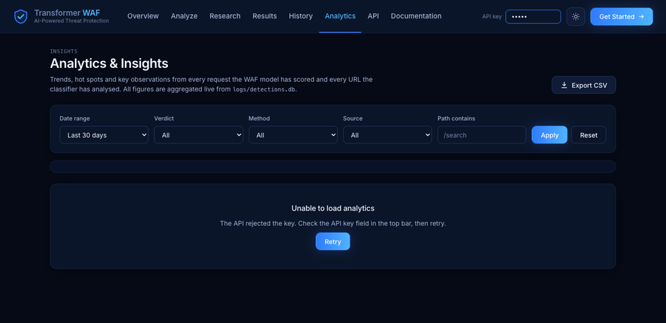

# Themes and devices

The page follows the site theme: use the sun icon in the top bar to switch
between dark and light. It works on desktop, tablet and phone — cards
re-arrange into two columns and charts resize to the screen width.

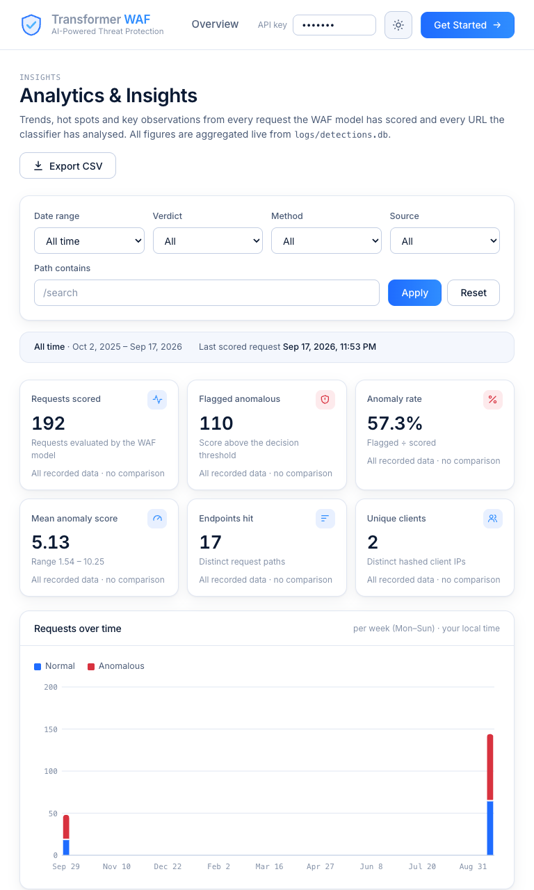

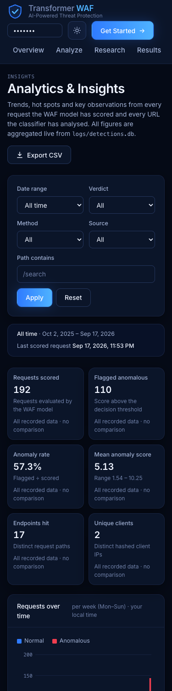

# Good to know

* **No accuracy figures for live traffic.** Real requests have no “correct
  answer” attached, so the page shows what the model decided, not whether it
  was right. Accuracy, precision and recall for the models are on the
  **Research** page, measured on labelled test data.
* **Daylight saving.** Hour and day bars use your current UTC offset; in a range
  that crosses a daylight-saving change, bar edges can shift by one hour.
* **Client privacy.** Client IP addresses are never stored in plain text — only
  a hash — and the page shows only the first characters of it.
